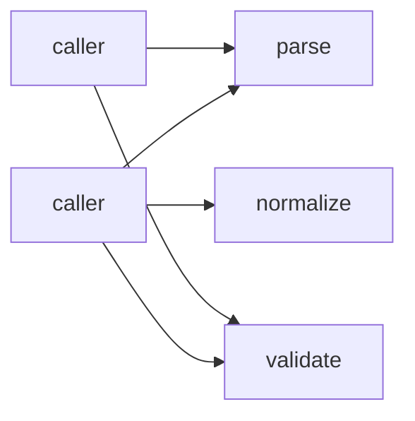
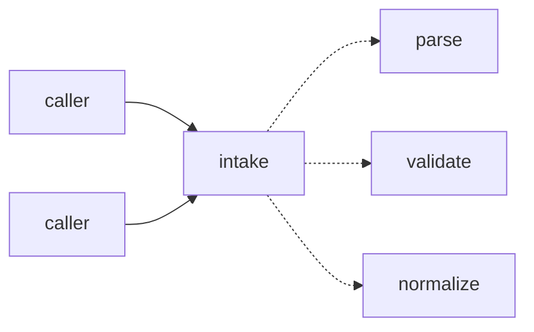

# Deliverables

Upstream `improve-codebase-architecture` writes a Tailwind + Mermaid HTML file to `$TMPDIR` and `xdg-open`s it, for a human sitting in front of it. A cron, routine, or headless firing has no display. This fork's first answer was to keep the whole presentation and change only the container — commit it as markdown at `.architecture/reviews/<date>-<slug>.md` — on the grounds that an unattended run must leave evidence it ran.

That conflated two different things. Evidence that a run happened is what the **backlog** and the **PR** are for. A per-candidate browser presentation, rewritten as a committed file, is read by nobody: no later firing opens it, and its reviewer-facing content is already restated in the PR body. In practice it outweighed the code it justified by an order of magnitude, which buries the actual refactor in its own PR diff.

So the review is a **scratchpad**, and the **PR body** is the deliverable. This file defines both.

## The run scratchpad

Working notes for this firing only. Write them to the session scratchpad directory — never into the repository, never into `.architecture/`, and never to a path a later run or a reader is pointed at.

**Never call `xdg-open`, `open`, or `start`.** An unattended run has no display.

It exists for one mechanical reason: step 4 produces several competing designs, and adjudication has to compare them against what was actually written rather than against memory. So each design is written here before the next is started, and a no-advisor adjudication reads them back off disk. Without that the fallback silently degrades into recalling designs it half-remembers.

Nothing in the scratchpad survives the run. Anything that must survive belongs in the backlog or the PR body, and the run is not done until it is there.

Keep whatever shape helps, but it must carry:

- **Candidates** — every candidate with its four axis scores and file-count estimate, so the PR body and the backlog can be written from one source
- **Design** — one entry per proposal (interface, usage example, what it hides, dependency strategy, trade-offs), each written *before* the next is started, then the adjudicator's verdict and why the winner beat the runner-up design

## The PR body

This is what a reviewer reads, and the only narrative artefact that outlives the run. Write it from the scratchpad at step 6.

It carries:

- **Problem** — why the current architecture causes friction. Name the shallowness concretely: the interface is nearly as complex as the implementation, or a caller reaches past the seam, or understanding one concept requires bouncing between modules
- **Deletion test** — what would happen if the module were deleted: does complexity concentrate, or just move?
- **Solution** — plain English, what changed
- **Benefits** — in terms of **leverage** and **locality**, and specifically how the test surface improves
- **Before / After** — two Mermaid diagrams, in that order, each fenced separately and labelled
- **Score** — the picked candidate's total out of 25 and its four axes, each with its one-line justification ([ranking.md](ranking.md))
- **Runner-up candidate** — what scored second in the ranking and why it lost. If the top two were within 1 point, say so: it tells a reviewer the pick was close and that the runner-up is the natural next firing
- **Runner-up design** — the interface that lost adjudication, and why
- **Proposed ADR** — under a `## Proposed ADR` heading, when the change warrants one. This run never writes an ADR itself
- **`CONTEXT.md` terms** — any term added or sharpened
- **Degradations** — flags forced, skills absent, sub-agents or advisor unavailable — or "none". A run that opens no PR records these in its exit report instead ([autonomy-contract.md](autonomy-contract.md))

"Runner-up" is used in two distinct senses and both reach the PR body: the runner-up **candidate** is the refactor that scored second; the runner-up **design** is the interface that lost adjudication. Always qualify which one is meant — never write a bare "runner-up".

Candidates that were **dropped** or judged **too large to automate** do not get prose here. They go to the backlog with their status and reason, which is where the next firing reads them ([ranking.md](ranking.md)) — and the next firing is the only thing that ever acts on them.

### Diagrams

Two ` ```mermaid ` blocks, before then after. Keep them small enough to read in a PR body — a dozen nodes at most. Convey the deepening, not the whole subsystem:



Above: a shallow cluster, callers wiring the steps themselves. Below: the same behaviour behind one seam.



Solid edges are the interface; dashed edges are inside the implementation. State that legend once in the PR body, replacing the upstream HTML legend.

## Vocabulary

Both artefacts use `CONTEXT.md` vocabulary for the domain and `codebase-design` vocabulary for the architecture. If `CONTEXT.md` defines "Order", write "the Order intake module" — not "the FooBarHandler", and not "the Order service".

## ADR conflicts

A candidate that contradicts an ADR is never picked for implementation ([ranking.md](ranking.md) hard filters), so it is never the subject of a PR. When the friction is real enough to warrant reopening that ADR, say so in the backlog entry's `Reason` with an explicit callout:

> **Contradicts ADR-0007.** Worth reopening because …

Do not record every theoretical refactor an ADR forbids. When the friction does not warrant reopening, drop the candidate quietly with the filter name as its reason.

## Where `.architecture/` is still written

Only `.architecture/backlog.md` ([ranking.md](ranking.md)). Its path is fixed so step 0 can find it without being told. This skill writes no other file under `.architecture/`, and in particular writes nothing under `.architecture/reviews/` — a directory earlier versions created, whose leftovers are not this run's to maintain or delete.
