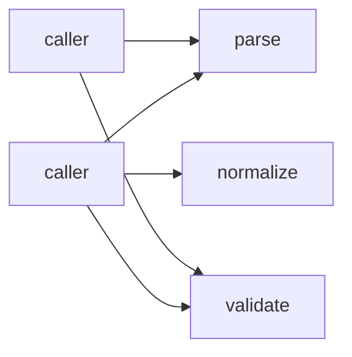
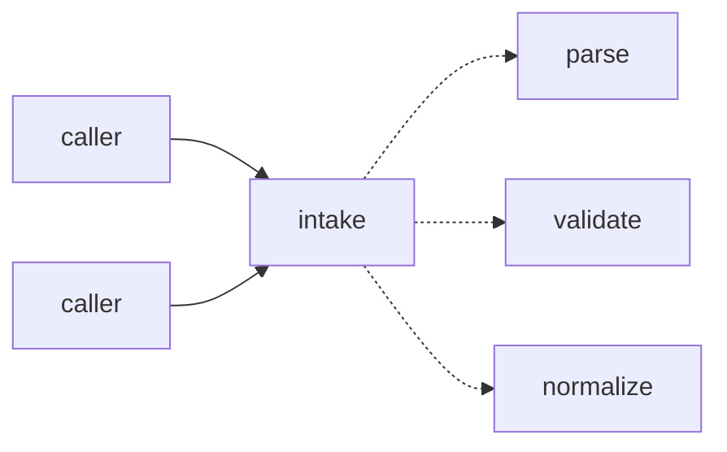

# Report Format

Upstream `improve-codebase-architecture` writes a Tailwind + Mermaid HTML file to `$TMPDIR` and `xdg-open`s it. A cron, routine, or headless firing has no display, and the temp file is discarded — so an unattended run would leave no evidence it ran. This file replaces that deliverable.

**Never call `xdg-open`, `open`, or `start`.** Never write the report to a temp directory.

## Where it goes

`.architecture/reviews/<YYYY-MM-DD>-<slug>.md`, committed on the run's branch and included in the PR. `<slug>` is the picked candidate's backlog slug (see [ranking.md](ranking.md)), so the report file, the backlog entry, and the PR all share one identifier. If that filename already exists — two firings on one day over an unchanged tree deterministically pick the same candidate — append `-2`, `-3`, and so on rather than overwriting: the earlier report may already be referenced from a PR.

Markdown, not HTML: GitHub renders it in the PR diff, and it renders in a terminal. GitHub renders ` ```mermaid ` fences natively, so the before/after diagrams survive the format change — that was the only thing the HTML was buying.

Create `.architecture/` lazily. Keep the directory as-is: the backlog's path is fixed so that step 0 can find it without being told, and splitting the two artefacts across directories silently breaks dedup.

## Structure

```markdown
# Architecture review — <repo> — <YYYY-MM-DD>

**Scope**: <what was scanned, and why that scope>
**Picked**: <slug> — see [PR #N] and `.architecture/backlog.md`
**Degradations**: <flags forced, skills absent, sub-agents unavailable — or "none">

## Candidates

### <slug> — <one-line title>  ·  Strong | Worth exploring | Speculative  ·  score 22/25

...one card per candidate, highest score first...

## Dropped

## Too large to automate

## Pick

## Design
```

## Candidate card

Each card carries the upstream fields, plus the scores that made the pick auditable:

- **Files** — which modules are involved, as `path:line` where a specific seam is meant, plus the file-count estimate the blast-radius band was derived from
- **Score** — the total out of 25 and the four axes, each with its one-line justification ([ranking.md](ranking.md))
- **Problem** — why the current architecture causes friction. Name the shallowness concretely: the interface is nearly as complex as the implementation, or a caller reaches past the seam, or understanding one concept requires bouncing between modules
- **Deletion test** — what would happen if the module were deleted: does complexity concentrate, or just move?
- **Solution** — plain English, what would change
- **Benefits** — in terms of **leverage** and **locality**, and specifically how the test surface improves
- **Before / After** — two Mermaid diagrams, in that order, each fenced separately and labelled
- **Recommendation strength** — `Strong`, `Worth exploring`, or `Speculative`, as plain text next to the heading

### Diagrams

Two ` ```mermaid ` blocks per card. Keep them small enough to read in a PR diff — a dozen nodes at most. Convey the deepening, not the whole subsystem:



Above: a shallow cluster, callers wiring the steps themselves. Below: the same behaviour behind one seam.



Solid edges are the interface; dashed edges are inside the implementation. Use that convention consistently and state it once in the report header, replacing the upstream HTML legend.

## The other sections

**Dropped** — a table of candidates the hard filters removed, with the filter that removed each. This is what stops the next run from re-deriving and re-dropping the same ideas:

| Candidate | Dropped because |
|---|---|
| `foo-bar-seam` | Leverage 1 — fails the deletion test, complexity would move to callers |

**Too large to automate** — candidates excluded for blast radius 5. These are real, they are just not one-PR work. A human schedules them.

**Pick** — which candidate was taken and why it outranked the **runner-up candidate**. If the top two were within 1 point, say so. This section replaces the upstream *"Which of these would you like to explore?"* prompt: it is the same information, stated as a decision instead of a question.

**Design** — written in step 4, after the rest of the report is already committed; amend the file and commit again. Holds each design-it-twice proposal (interface, usage example, what it hides, dependency strategy, trade-offs), the adjudicator's verdict, and why the winner beat the **runner-up design**.

"Runner-up" is used in two distinct senses and both reach the PR body: the runner-up **candidate** is the refactor that scored second in the *Pick* section; the runner-up **design** is the interface that lost adjudication in the *Design* section. Always qualify which one is meant — never write a bare "runner-up".

A `--report-only` run still emits the *Design* heading, with one line saying no design pass ran. Present-but-explicit beats absent: a routine diffing successive reports should not have to tell a skipped section from a truncated file.

## Vocabulary

Use `CONTEXT.md` vocabulary for the domain and `codebase-design` vocabulary for the architecture. If `CONTEXT.md` defines "Order", write "the Order intake module" — not "the FooBarHandler", and not "the Order service".

## ADR conflicts

A candidate that contradicts an ADR is never picked for implementation ([ranking.md](ranking.md) hard filters). Surface it in the report anyway when the friction is real enough to warrant reopening that ADR, marked with a blockquote callout, so a human can decide:

> **Contradicts ADR-0007.** Worth reopening because …

Do not list every theoretical refactor an ADR forbids. When the friction does not warrant reopening, drop the candidate quietly and record it in the *Dropped* table.
